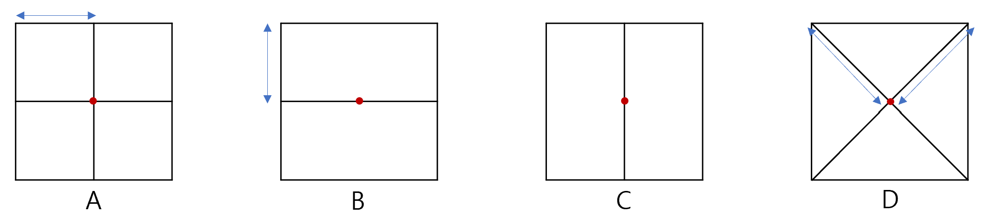

# 문제
aespa는 현재 지도를 참고해 광야의 한 점에서 출발해 KOSMO에 도달하고자 하는데 여기에는 광야의 각 지역에는 해당 지역을 통과할 수 있는 최소한의 레벨이 있어 에스파가 그 레벨 이상이어야만 통과할 수 있다는 절대적인 룰이 있다. <br>
asepa는 처음에 레벨 1부터 시작하지만 다행히도 aespa가 과제 마왕의 고난을 이겨내면 Next Level로 나아가서 레벨이 1만큼 상승하고, 그만큼 강해진 한층 더 자유롭게 움직일 수 있다. <br>
과제마왕의 고난을 이겨내기 위해서는 2가지 조건을 만족해야 한다. <br>
먼저 에스파의 레벨이 과제 마왕이 위치한 지역의 통과 레벨 이상이어야 하며, 에스파가 과제마왕이 내는 과제에 사용되는 알고리즘을 사전에 알고 있어야 한다. 에스파는 처음부터 1개 이상의 알고리즘을 알고 있으며, 고난을 이겨내면 0 1개의 알고리즘을 익힐 수 있다. <br>
그런데 Black Mamba가 aespa를 방해하고자 유일한 지도를 N x N 조각으로 찢어버렸으나, 다행히 카리나가 지도의 원래 구조를 기억해냈다. <br>
지금부터 여러분은 카리나의 기억대로 지도를 다시 만들고 에스파가 절대적 룰을 지켜 KOSMO에 닿을 수 있는지 알아보자. <br>
단, 에스파는 절대 뒤를 돌아보지 않기에 왔던 길을 다시 가지는 않는다. <br>


### 입력
먼저 N이 주어진다. 그리고 다음 N개의 줄에 걸쳐 지도의 각 조각들이 N개씩 주어진다. <br>
그 다음 N개의 줄에 걸쳐 각 조각들이 속한 지역을 탐사하는 것에 필요한 최소 레벨이 주어진다. <br>
이때 각 조각들이 중첩되는 지역의 최소 탐사 레벨은 높은 것이 최소 레벨이 된다. <br>
이어서 다음 N 개의 줄에 걸쳐 각 조각 별 과제 마왕의 존재 여부와 해당 과제 마왕을 처치하는 것에 필요한 알고리즘, 해당 과제 마왕을 처치하면 얻을 수 있는 알고리즘이 N쌍씩 주어진다. 이때 과제마왕은 항상 조각의 중심에 위치하며, 과제마왕이 존재하면 1 존재하지 않으면 0으로 표시되며, 알고리즘은 모두 소문자로 주어지고, 알고리즘이 비어있는 경우는 0으로
표시된다. 다음 줄에는 aespa가 처음에 익히고 있던 알고리즘의 수가 주어지고, 이어서 다음 줄에 구체적인 알고리즘이 나열된다. <br>
aespa는 항상 지도의 좌측 최상단, KOSMO는 항상 우측 최하단에 위치한다. <br>

### 출력
aespa가 KOSMO에 도달할 수 있으면 ‘Dreams Come True’를 <br>
도달할 수 없으면 -1을 출력하면 된다. <br>

### 예제 입력 1
```
4
ABAD
DDDD
BBBB
CCCC
1131
1221
3333
1114
0 0 0 1 dp greedy 0 0 0 0 0 0
0 0 0 1 dp sort 1 graph dfs 0 0 0
1 greedy sort 1 sort dp 0 0 0 0 0 0
0 0 0 0 0 0 0 0 0 1 bfs graph
1
dp
```
### 예제 출력 1
```
Dreams Come True
```

### 예제 입력 1 참고 사항
<br>


```
예시 입력 1의 지도 조각들을 합해 지도를 만들면 위와 같다. 
그리고 지도에서 빨간 부분과 같이 서로 다른 조각의 경계면은 두 조각 중 높은 레벨이
최소 통과 레벨이 된다.
```