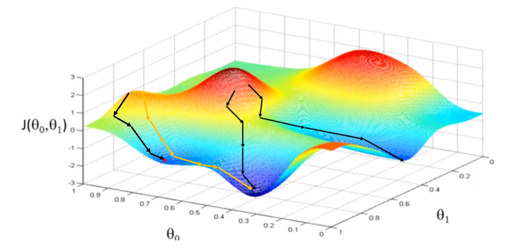

# 문제

산지니가 수강하고 있는 머신러닝 강의에서 Gradient Descent를 수행해야 하는 과제가 출제되었다. <br>
Gradient Descent란 머신러닝 모델의 오차를 나타내는 Loss Function이 최소가 되도록 모델의 매개 변수를 학습하는 방법을 지칭한다. 2개의 매개 변수를 가진 머신 러닝 모델의 학습 과정을 x축과 y축이 각각 매개 변수가 되고 z축이 Loss Function의 값이 되는 3차원 그래프를 그리면 다음과 같으며 그림에서의 화살표는 모델의 학습을 표현한 것이다. <br>



Gradient Descent에서 매개 변수의 학습은 Loss Function을 각 매개변수에 대하여 편미분을 수행하여 Loss Function의 기울기가 낮은 방향으로 이루어진다. 하지만 순수한 Gradient Descent는 항상 기울기를 따라 학습이 이루어지기에 그림 1의 빨간 별이 표시된 것과 같은 Local Optimum에 빠지면 탈출할 수 가 없어 모델의 오차를 더 이상 줄이지 못한다. <br>

그래서 이에 대한 해결책으로 Gradient Descent와 함께 momentum이라는 일종의 관성력을 추가해서 학습하기도 하는데, momentum은 마치 현실의 관성력이 그러하듯 과거에 진행해왔던 방향으로 계속 진행하려는 것을 말하며 이 덕분에 일시적인 머신러닝 모델의 학습과정에서 Local Optimum에 빠지더라도 모델은 그림 -1에서의 노란색 화살표와 같이 탈출 할 수 있게 된다. <br>
또한 일반적으로는 언제 모델의 오차가 가장 최소화되었는 지 알 수 없어 여러 가지 장치들을 동원하는 데 그 중 하나가 모델이 일정 횟수 이상 학습을 하더라도 오차의 개선이 없으면 학습을 종료하는 Early Stop이다. <br>

이때 산지니가 해야할 것은 2개의 매개 변수를 가지는 머신러닝 모델이 momentum과 Early Stop을 적용한 gradient descent를 통해 학습할 때의 Loss Function의 값의 변화를 그래프로 그리는 것이다. 하지만 산지니는 미분을 할 줄 모르기에 정확한 계산을 하기보다는 Loss Function의 공간을 전역탐색하고 대충 그걸 바탕으로 그럴듯 하게 경로를 구하기로 했다. <br>

산지니는 경로를 구할때 Gradient Descent의 정의대로 현재 위치에서 Loss Function의 값이 최소가 되는 방향으로 매개변수 하나를 1만큼 변화하도록 하기로 했으며 momentum의 경우 임의로 이전 진행방향대로 매개변수를 1만큼 변화하도록 하였다. 이때 Gradient Descent로 인한 매개변수 업데이트와 momentum으로 인한 매개변수 업데이트는 동시에 일어날 수 없도록 하였으며 또한 연속해서 momentum을 적용하지 않기로 했다. 마지막으로 최대 10회까지 학습이 이루어져도 오차의 최솟값의 갱신이이 없으면 학습을 종료하기로 했다. <br>

하지만 산지니는 전역변수의 공간을 탐색하는 것에 너무 힘을 쓴 나머지 그만 잠이 들어 미처 경로 탐색은 수행하지 못하였다. 지금부터 여러분이 수행할 일은 산지니가 그래프를 그릴 수 있도록 모델의 학습 경로를 찾고 경로에 따른 Loss Function의 값을 출력하는 것이다. <br>

### 입력

먼저 산지니가 찾아놓은 Loss Function 공간의 크기 N, M이 주어진다. 그리고다음 N개의 줄에 걸처 M개의 Loss Function의 값이 주어진다. 마지막으로는 경로 탐색을 시작할 위치 ω0, ω1가 주어진다. 이때 ω0는 공간의 x축, ω1은 공간의 Y축을 의미하며 좌측 최상단은 각각 0 일때를 의미한다.

### 출력

시작 위치에서 최종적으로 도달 가능한 가장 낮은 Loss Function의 값까지 도달하는 경로 상의 Loss Function 의 값 한 줄 씩 출력하면 된다. 이때 가능한 경로가 여러 개라면 그 중 1개만 출력하면 된다.

### 예제 입력 1

```
6 7
100 101 200 150 300 400 1
87 89 65 67 66 67 100
30 38 21 40 55 57 300
40 35 18 20 10 10 10
43 41 6 4 10 2 4
100 100 100 100 10 4 4
0 0
```
### 예제 출력 1

```
100
87
30
40
35
18
6
4
10
2
4
2
4
```
학습의 종료는 항상 Early Stop에 의해 종료된다는 것을 유의해야 한다.
